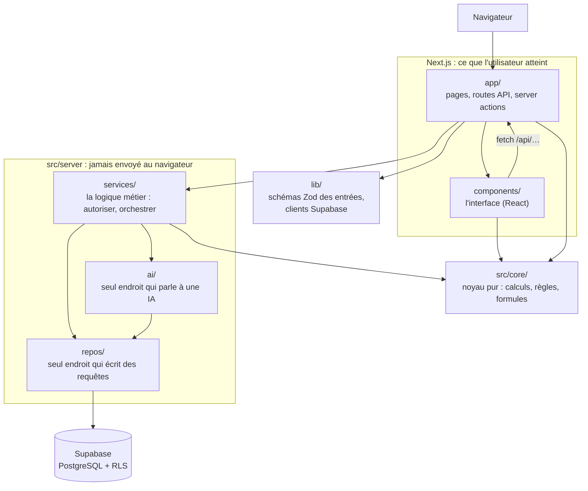
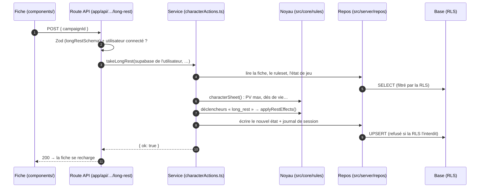

# Architecture de CreaDonjon

**À quoi sert ce document.** C'est la carte du code : quel dossier fait quoi, qui a le droit d'appeler qui, et le chemin d'une action du clic jusqu'à la base. Il **renvoie** aux autres documents au lieu de les recopier :

- les tables sont dans [`SCHEMA.md`](SCHEMA.md) ;
- le « pourquoi » de chaque choix est dans [`adr/`](adr/) ;
- le comportement attendu est dans [`PDD.md`](PDD.md) ;
- l'interface est dans [`CHARTE-UI.md`](CHARTE-UI.md).

**Le code fait foi.** Si ce document et le code divergent, c'est le document qui a tort. Un ticket qui déplace une frontière décrite ici le met à jour dans le même commit.

---

## 1. L'idée centrale

CreaDonjon n'a pas « un wiki » et « un moteur de règles » côte à côte. Il a **un seul modèle** :

- une **entité** (`entities`) est n'importe quoi du monde : personnage, lieu, faction, objet ;
- ce qu'elle *est* vient des **blocs** qu'on lui attache : un bloc de texte narratif, un bloc `character` qui lui donne des statistiques, un bloc d'inventaire…

C'est pourquoi le code ne demande jamais « est-ce un personnage ? » mais « a-t-elle un bloc `character` ? ». Voir [ADR 0007](adr/0007-moteur-fiche-derivee.md) et [ADR 0023](adr/0023-enregistrement-des-blocs.md).

## 2. Les couches

Une application web se découpe en **couches** : chacune a un rôle, et chacune n'appelle que celles qui sont « en dessous ». Ça évite le plat de spaghettis où tout dépend de tout. Une couche du dessous ne connaît jamais celle du dessus.

| Dossier | Son rôle | Il a le droit d'importer |
|---|---|---|
| `app/` | Les **pages** (ce qu'on voit à une adresse), les **routes API** (`app/api/…/route.ts`, appelées par `fetch`) et les **server actions** (`app/actions.ts`). C'est la porte d'entrée : on y valide l'entrée et on vérifie la connexion. | `lib/`, `src/server/services/`, `src/core/`, `components/` |
| `components/` | L'**interface** en React, rangée par domaine (`blocks/`, `rules/`, `shell/`, `solo/`…). Un composant client (`"use client"`) ne touche **jamais** la base : il passe par une route API. | `src/core/`, `lib/` (schémas), autres composants |
| `lib/` | Les **schémas Zod** des entrées (`lib/<domaine>/schemas.ts`) et les **clients Supabase** (`lib/supabase/`). | `src/core/` |
| `src/server/services/` | La **logique métier** : qui a le droit, dans quel ordre on fait les choses. Un service assemble des repos et des calculs du noyau. | repos, `ai/`, `src/core/`, d'autres services (sans boucle, V3.1-120) |
| `src/server/repos/` | Les **requêtes Supabase**, et rien d'autre (règle absolue 20). Un repo ne décide rien : il lit ou écrit. | `src/core/` (types) |
| `src/server/ai/` | Les **appels d'IA** (règle 12) : `callAi.ts` journalise chaque appel, `provider.ts` définit l'interface `AiProvider`, `adapters/` branche un fournisseur. | repos, `src/core/` |
| `src/core/` | Le **noyau pur** : fiche dérivée, déclencheurs, formules, visibilité, permissions. **N'importe rien** de Next, de React, de Supabase ni du réseau (règle 19, vérifiée par ESLint). C'est là que vit la logique difficile, testée en millisecondes. | rien d'extérieur |

Autour :

- `messages/` et `src/i18n/` tiennent les **libellés** ;
- `supabase/migrations/` tient l'**historique du schéma** (une migration appliquée ne se modifie jamais) ;
- `src/types/database.ts` contient les **types générés** depuis la base ;
- `scripts/` contient les **scripts d'import** (SRD, traductions) ;
- `proxy.ts` rafraîchit la session à chaque requête.

> **Pourquoi `src/core` est si strict ?** Parce qu'un calcul de règle qui ne dépend ni de la base ni du réseau se teste instantanément, se réutilise partout (serveur, interface, IA), et se lit sans contexte. C'est l'investissement qui rend le moteur fiable.

## 3. Le trajet d'une action : « Repos long »

Exemple réel, à suivre dans le code. Une joueuse clique sur « Repos long » sur sa fiche.

Fichiers à ouvrir dans l'ordre :

1. `app/api/entities/[id]/actions/long-rest/route.ts`
2. `src/server/services/characterActions.ts` (`takeLongRest`)
3. `src/core/rules/sheet.ts` (`characterSheet`)
4. `src/core/rules/restEffects.ts`
5. `src/server/services/runtimeState.ts`

Trois choses à remarquer :

- **La route valide, le service décide, le noyau calcule, le repo écrit.** Chacun son métier.
- **Le serveur utilise le client Supabase *de l'utilisateur*.** La base applique donc ses propres règles d'accès, la **RLS** (*Row Level Security* : chaque table dit qui peut lire ou écrire chaque ligne). C'est la dernière barrière, même si le code se trompe. *Limite connue* : l'état de jeu est aujourd'hui modifiable par tout membre du monde ; c'est V3.1-108 (ADR 0043).
- **Les valeurs dérivées ne sont jamais stockées** (règle 16). Les PV max, la CA et les jets sont recalculés par `characterSheet()` à chaque fois. Seul l'état qui change en jouant (PV actuels, emplacements utilisés…) est enregistré.

## 4. La sécurité en trois barrières

1. **À l'entrée** : chaque route et chaque server action valide son entrée avec un schéma Zod (règle 4).
2. **Dans le service** : les vérifications de droit.
   - `canEditEntity` (`src/core/permissions/`) pour écrire une entité ;
   - `isWorldAdmin`, `canUserEditEntityById` (`src/server/services/permissions.ts`) ;
   - `canActOnMemberAccount` (`src/core/accounts/`) pour agir sur le compte d'autrui.
3. **Dans la base** : la RLS, activée sur toutes les tables, refus par défaut.

**La visibilité** (qui voit un bloc, un segment, une entité) se décide **côté serveur, avant l'envoi**, avec `src/core/visibility/` (`canSee`, `filter`). Un secret de MJ n'arrive jamais au navigateur, même caché. Voir [ADR 0002](adr/0002-modele-visibilite.md).

**Trois fichiers seulement passent outre la RLS** (le client *service role*), chacun confiné par une règle ESLint :

| Fichier | Pourquoi | ADR |
|---|---|---|
| `src/server/services/publicShare.ts` | lire une page partagée publiquement, sans compte | [0018](adr/0018-visibilite-publique-anonyme.md) |
| `src/server/services/accountProvisioning.ts` | rattacher un compte à une campagne, « voir comme » | [0015](adr/0015-provisioning-comptes-invites.md), [0052](adr/0052-agir-sur-le-compte-d-un-membre.md) |
| `src/server/services/accountAuth.ts` | tout ce qui touche un mot de passe | [0031](adr/0031-comptes-tag-et-mots-de-passe-natifs.md) |

Un quatrième chemin privilégié est décidé mais pas encore codé : les changements signés du moteur ([ADR 0041](adr/0041-ecritures-du-moteur-au-nom-d-un-joueur.md), V3.1-104).

## 5. Les grands sous-systèmes

Pour chacun, le point d'entrée dans le code et l'ADR qui l'explique.

| Sous-système | Ce qu'il fait | Où commencer | Pourquoi |
|---|---|---|---|
| **Entités et blocs** | Le modèle unifié : une entité, des blocs typés, chacun avec sa visibilité. | `src/core/schemas/blocks/`, `src/server/services/entities.ts` | [0007](adr/0007-moteur-fiche-derivee.md), [0023](adr/0023-enregistrement-des-blocs.md) |
| **Rulesets et surcharges** | Une base officielle (SRD) jamais modifiée ; une variante hérite de son parent et ne stocke que ses **surcharges** (`ruleset_overrides`). Lire une règle, c'est remonter la chaîne. | `src/server/services/rules.ts` (`walkRulesetChain`, `resolveEntryBlocksInRuleset`), `src/server/services/resolvedRuleset.ts` | [0030](adr/0030-ecriture-du-ruleset-actif-reservee-au-createur.md), `specs/regles-couche.md` |
| **Fiche dérivée** | De l'espèce, de l'historique, des classes et des choix, calcule toute la fiche : caractéristiques, compétences, CA, PV. Fonction pure. | `src/core/rules/sheet.ts` (`characterSheet`) | [0007](adr/0007-moteur-fiche-derivee.md) |
| **Formules** | `2d6 + mod(str)` : un analyseur fermé, jamais d'`eval` (règle 7). | `src/core/formula/` | [0004](adr/0004-ast-formules.md) |
| **Déclencheurs** | « Quand tel événement, si telle condition, alors tels effets », dans un vocabulaire fermé. Le noyau évalue ; le serveur fait partir les événements. | `src/core/rules/triggers.ts` (`runTriggers`), `src/server/services/triggerRuntime.ts`, `combatTriggers.ts` | [0027](adr/0027-conditions-de-declencheur-hors-de-l-ast-numerique.md), [0028](adr/0028-evenements-de-test-et-discrimination-des-evenements.md), [0050](adr/0050-effet-accorder-l-inspiration.md) |
| **Tour de jeu solo** | Intention du joueur → jets par le serveur → effets appliqués → narration par l'IA. | `src/server/services/turnLoop.ts` (`playTurn`), `src/core/rules/turn.ts` | [0009](adr/0009-viabilite-solo.md), `specs/moteur-de-jeu.md` |
| **IA** | L'IA raconte, le code arbitre (règle 8). Chaque appel est journalisé ; une modification proposée par l'IA passe par `ai_proposals` avant d'être appliquée. | `src/server/ai/callAi.ts`, `src/server/services/aiProposals.ts` | `specs/cible-locale-et-ia.md` |
| **Comptes et invitations** | Comptes « tag » (sans email réel), liens d'invitation, « voir comme ». | `src/server/services/accountAuth.ts`, `campaignInvites.ts`, `viewAs.ts` | [0031](adr/0031-comptes-tag-et-mots-de-passe-natifs.md), [0051](adr/0051-retour-de-voir-comme-par-jeton.md), [0052](adr/0052-agir-sur-le-compte-d-un-membre.md) |
| **Fichiers** | Images et pièces jointes, derrière une interface (cible locale, règle 24). | `src/server/services/storage.ts` | [0017](adr/0017-cartes-modele-et-stockage.md) |

## 6. Où mettre du code nouveau

| Je veux… | Ça va dans… |
|---|---|
| un calcul de règle, une formule, une décision « a-t-il le droit ? » sans base | `src/core/<domaine>/`, **tests d'abord** à côté (`*.test.ts`) |
| lire ou écrire une table | une fonction dans `src/server/repos/<table>.ts` |
| enchaîner lecture, droits, calcul et écriture | un service dans `src/server/services/` |
| une adresse que l'interface appelle | `app/api/<chemin>/route.ts`, entrée validée par un schéma de `lib/<domaine>/schemas.ts` |
| un écran ou un élément d'interface | `components/<domaine>/`, après la charte et le catalogue ; libellés dans `messages/` |
| une nouvelle colonne ou table | une **nouvelle** migration dans `supabase/migrations/`, puis `SCHEMA.md` et les types régénérés |
| un appel d'IA | `src/server/ai/`, par `runAiCompletion` |
| une règle de jeu (sort, don, sous-classe…) | **pas dans le code** : en base, ou dans `data/personnel/` (ignoré par Git) |

## 7. Les tests

- `*.test.ts`, à côté du fichier testé. `npm run test:core` lance ceux du noyau, en quelques secondes.
- `*.integration.test.ts` touchent une vraie base Supabase. Ils sont sautés quand aucune base n'est configurée.
- Avant de dire qu'une tâche est finie : `npm run typecheck && npm run lint && npm run test`.
